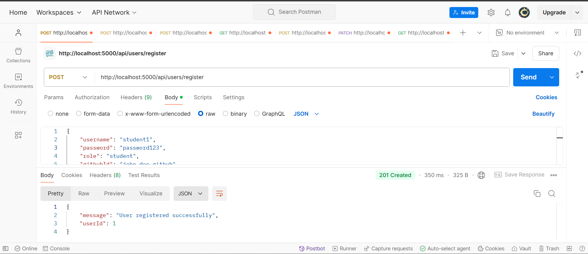
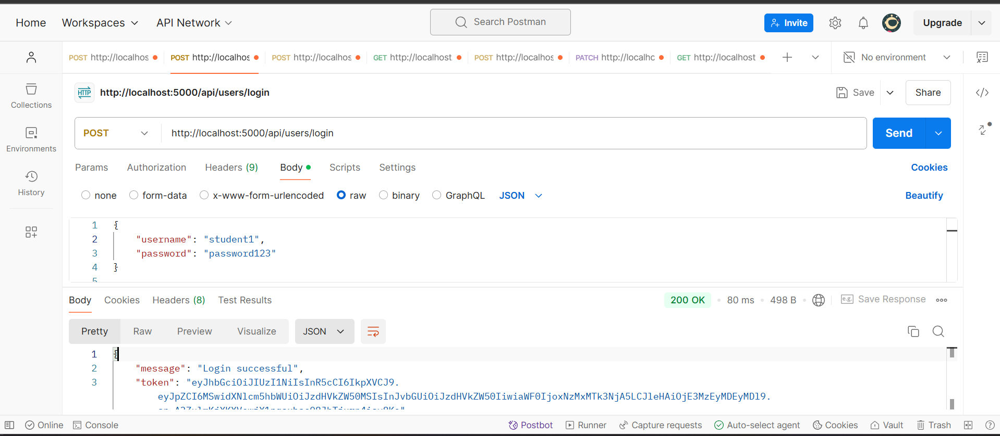
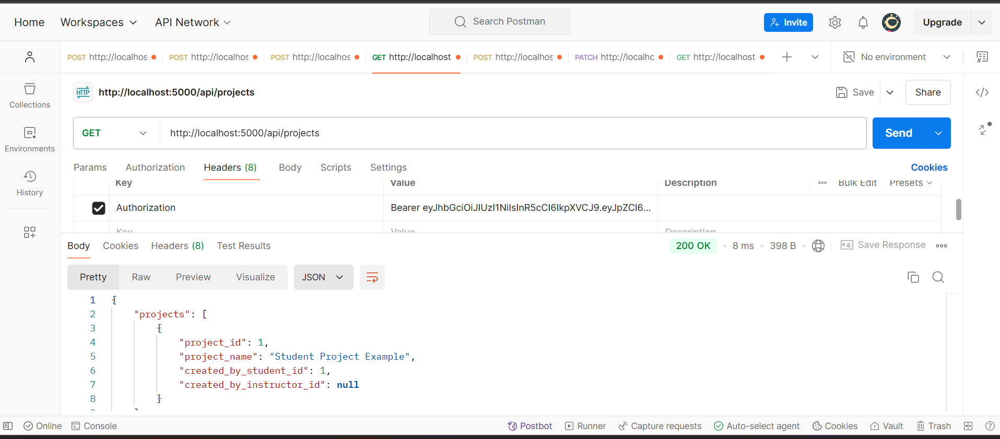
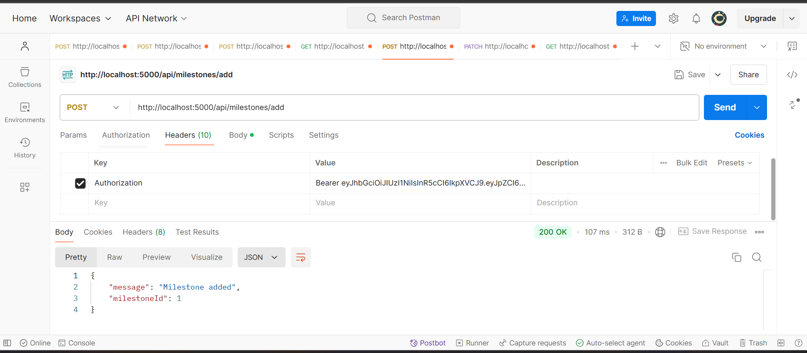
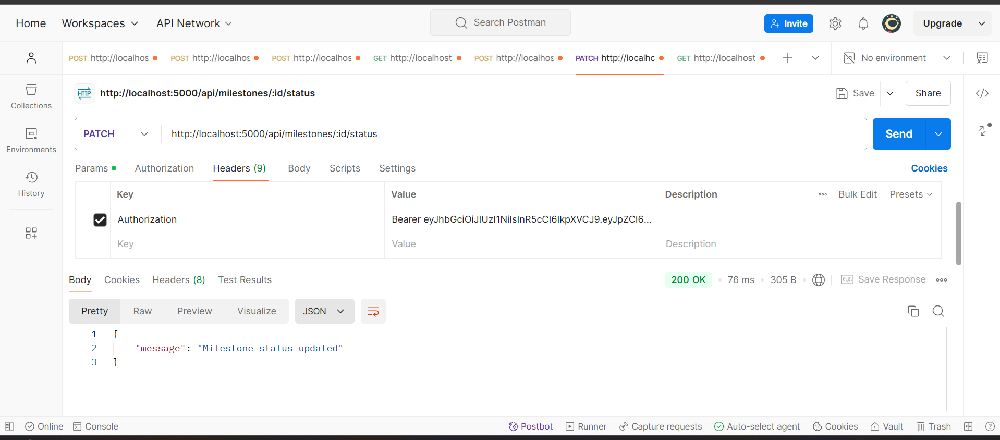
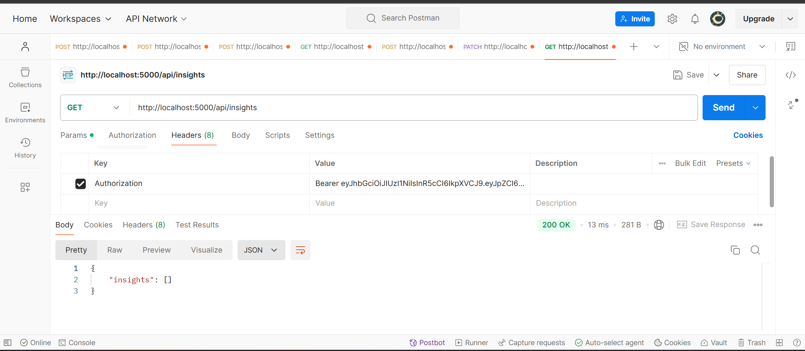

# Project Management API

This API provides endpoints for managing projects, including user registration and login, project creation, milestone tracking, and retrieving project insights. It is designed for students and instructors to manage and track project progress.

---

## Table of Contents

1. [Setup](#setup)
2. [Running the Server](#running-the-server)
3. [API Endpoints](#api-endpoints)
    - [Register User](#1-post-apiusersregister)
    - [Login](#2-post-apiuserslogin)
    - [Create Project](#3-post-apiprojects)
    - [Get Projects](#4-get-apiprojects)
    - [Add Milestone](#5-post-apimilestonesadd)
    - [Update Milestone Status](#6-patch-apimilestonesidstatus)
    - [Get Insights](#7-get-apiinsights)

---

## Setup

1. Clone the repository:
   ```bash
   git clone https://github.com/Vikas-Jha19/SE_Project_Management.git
   ```
2. Navigate to the project directory:
   ```bash
   cd <project-directory>
   ```
3. Install dependencies:
   ```bash
   npm install
   ```

## Running the Server

To start the server on port 5000, run the following command:

```bash
npm start
```

The server will be accessible at `http://localhost:5000`.

---

## API Endpoints

### 1. POST /api/users/register

**Description:** Register a new user (student or instructor).

**Body:**
```json
{
    "username": "student1",
    "password": "password123",
    "role": "student",
    "githubId": "john_doe_github"
}
```

**Response:**
```json
{
    "message": "User registered successfully",
    "userId": 1
}
```

---

### 2. POST /api/users/login

**Description:** Login and receive a JWT token.

**Body:**
```json
{
    "username": "student1",
    "password": "password123"
}
```

**Response:**
```json
{
    "message": "Login successful",
    "token": "jwt_token_here"
}
```

---

### 3. POST /api/projects

**Description:** Create a new project (available to students and instructors).

**Body:**
```json
{
    "project_name": "New Project"
}
```

**Response:**
```json
{
    "message": "Project created successfully",
    "projectId": 1
}
```

---

### 4. GET /api/projects

**Description:** Fetch all projects.

**Response:**
```json
[
    {
        "project_id": 1,
        "project_name": "New Project",
        "created_by_student_id": 1
    }
]
```

---

### 5. POST /api/milestones/add

**Description:** Add a milestone to a project.

**Body:**
```json
{
    "projectId": 1,
    "milestoneName": "Milestone 1",
    "dueDate": "2024-12-31"
}
```

**Response:**
```json
{
    "message": "Milestone added",
    "milestoneId": 1
}
```

---

### 6. PATCH /api/milestones/{id}/status

**Description:** Update milestone status.

**Body:**
```json
{
    "status": "completed"
}
```

**Response:**
```json
{
    "message": "Milestone status updated"
}
```

---

### 7. GET /api/insights

**Description:** Get project insights.

**Response:**
```json
[
    {
        "insight_id": 1,
        "data": "Insight data here",
        "created_at": "2024-11-01T10:00:00"
    }
]
```

